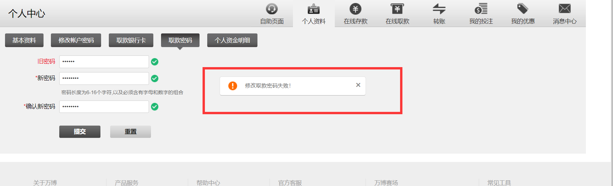

# study
学习之旅
##### 解决问题的能力，学习能力，自然你就money了
##### 热爱工作，快乐工作
###### 时间管理 思维 思路 方法 弄懂原理
###### 工作结果好=思维方式+自身能力+热情

###### 前端的基础大概分为以下几个方向

```
1、html/css：包括html语义化、css布局等

2、dom/bom：dom操作，dom api，浏览器属性/事件等

3、js语言：闭包、js语法、原型链继承、es6、es7、typescript等

4、框架：React/Vue/Angular

5、打包构建：webpack/rollup

6、网络协议：http/https协议、tcp/ip、dns、cdn等

7、数据结构和算法：搜索、排序、链表、树等

8、操作系统：linux基本命令、进程线程、网络、内存、系统调用等

9、服务端：nodejs、python、java、nginx等

10、跨端：webview、react-native、flutter等


```


###### es5和es6的演变升级
|ES5|ES6|ts   .ts文件会构建成js|
|:---|:---|:---|
|var|let 块级作用域|趋向后端语言的规范写法|
|prototyp|class|var num:number=10 / (a:string,b:number):boolean=>{}|
|function(){}|()=>{}|可以结合vue和react开发项目|
||解构赋值|可以有修饰符，例如public|
||展开运算符|还可以命名空间|
||数组find和findIndex和includes|接口interface|
||字符串新增方法和模板字符串|枚举类型|
||对象新增方法与babel|any|

###### 客户端和服务器的对话
|cookie|session|token|
|:---|:---|:---|
|客户端|服务器|服务器|
||||
||||
||||

###### js事件执行机制  (Event Loop)
|执行栈（主线程）|队列|
|:---|:---|
|同步|异步|
||宏任务|
||微任务|
|||

###### css样式的演变发展  模块编译   适配
|flex|gird|float|less|sass|stylus|rem|vw|
|:---|:---|:---|:---|:---|:---|:---|:---|
|弹性布局|栅格布局|脱离文档流||||||

###### 基本类型()  检测
|Number|String|Null|Undefined|Boolean|typeof|instanceof|
|:---|:---|:---|:---|:---|:---|:---|
|Number|indexOf|||true|'number'||
||split|||false|'string'||
||charAt||||'null'||
||join||||'undefined'||
||substr||||'boolean'||
||substring||||||
||slice||||||
###### 引用类型()
|Object|Array|
|:---|:---|
|Object.values|forEach|
|Object.keys|map|
|Object.assign|filter|
|Object.prototype.toString|reduce|

###### 库和框架
|jq|vue|react|ng|
|:---|:---|:---|:---|
|加载$(function() {})|vue-cli|create-react-app||
|$('#id')|vue-router|redux||
|$.fn.show=fn|vuex|hooks||
|操作dom元素|改变数据|jsx||
||生态|社区生态||
||知识点应用场景|应用场景||

```
//vuex代码块
mapState\mapActions\mapMutations\mapGetters
state={}
actions={}
mutations={}
getters={}
```
```
//异步不同方式，优缺点
new Promise((resolve,reject)=>{
	
}).then(res=>{

}).catch(err=>{

})
async fn(){
let res=await getData()
}
```
###### webpack模块打包器
|webpack|axios|
|:---|:---|
|entry|axios({})|
|output|get|
|loader|post|
|plugins||


[点击前往掘金的链接](https://juejin.im/post/5de87444518825124c50cd36)
[深有启发，点赞](https://www.jianshu.com/p/e8b143adb0d8)